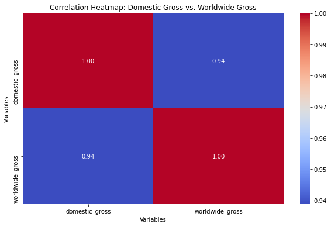
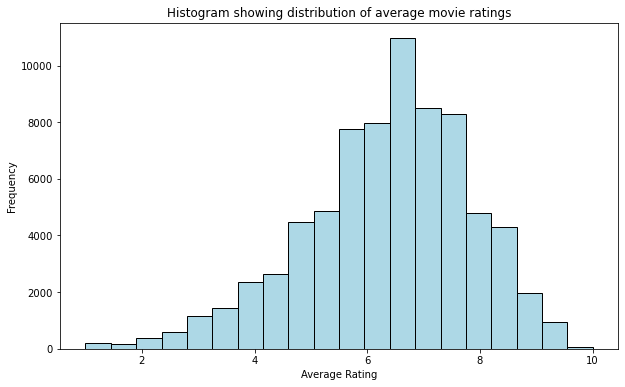
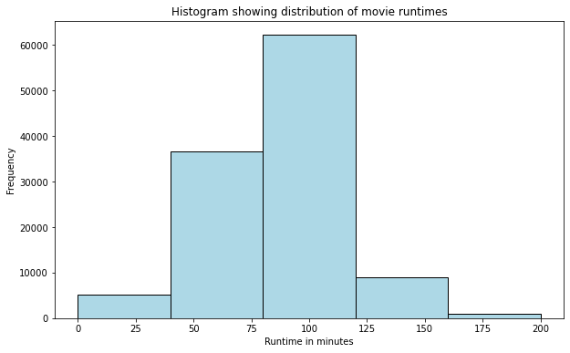
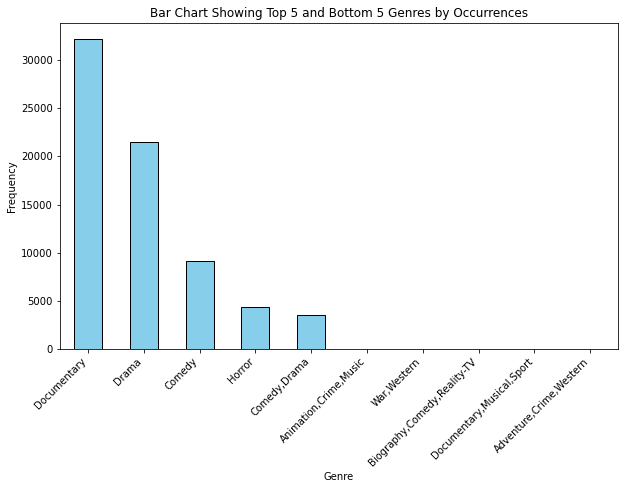

# Data-Science-_Movie_Content-Analysis
Data Science OO1 project on exploring Data Sets  -  project Link (https://github.com/learn-co-curriculum/dsc-phase-1-project-v2-4)

 

# Overview
This repository contains the analysis and findings of the Movie Studio Project, which aims to provide insights to Microsoft Studios on achieving financial success in the movie industry. The project explores factors influencing a movie's box office performance and profitability.

Data preparation and analysis is contained in the movie_studio_analysis.ipynb file.
Datacleaning & Preparation is contained in the data-preparation.ipynb file.
Data analysis and recommendations are contained the student.ipynb file.
Datacleaning & Preparation is contained in the data-preparation.ipynb file. Data analysis and recommendations are contained the student.ipynb file.

# Approach
To conduct the analysis, we followed these key steps:

Data Selection: We identified relevant features of interest, including movie titles, genres, runtime, budget, ratings, directors, and writers.

Data Cleaning: We performed data cleaning and preparation on a separate Jupyter Notebook, addressing missing values, casting datatypes, and handling compound entries.

Exploratory Data Analysis (EDA): After data preparation, we conducted EDA to gain insights into the relationships between movie attributes and box office performance.

# Features of Interest
The analysis focused on the following features:

1.Movie titles
2.Genres
3.Runtime
4.Budget
5.Ratings
6.Directors
7.Writers

# Datasets Used
The following datasets were used for analysis:

Title Basics Dataset: Contains movie titles, genres, and runtime information.

Tn.movie_budgets Dataset: Includes production budget, domestic gross, worldwide gross, and release date.

Tmdb Movies Dataset: Provides movie ratings, vote average, numvotes, and popularity.

Movie Info Dataset: Contains director, writer, and rating information.

# Exploratory Data Analysis Findings
Based on the EDA results, we discovered the following:

 

Based on the heatmap visualization presented, it is evident that there exists a statistically significant positive correlation between the production budget allocated for a movie and its corresponding domestic gross revenue. 

The correlation coefficient of 0.69 indicates a moderately strong positive linear relationship between these two variables.This implies that as the production budget of a movie increases, there is a tendency for its domestic gross revenue to also increase, suggesting a potential return on investment for higher budget productions

 

It is evident that a highly significant positive correlation exists between the domestic gross and worldwide gross, with a correlation coefficient of 0.94. This finding suggests a robust relationship wherein an increase in the production budget is strongly associated with a subsequent rise in domestic gross revenue. This correlation coefficient indicates a near-perfect positive linear relationship between the two variables, indicating that as the production budget increases, the domestic gross tends to increase in tandem. Such insights gleaned from the analysis provide valuable guidance for decision-making processes within the film industry, allowing stakeholders to make informed investment decisions and optimize revenue generation strategies.

 

From the histogram above,we can conclude that most movies are rated at 6.5.This also shows that 6.5 is the mean average rating for best performing movie rating scale

 

From the histogram above,we can conclude that most movies are 100 minutes long. This is the time frame for best standard performing movies

 

From the bar chart depicting genre popularity, it can be concluded that the top five most popular genres are documentary, drama, comedy, horror, and comedy/drama, with documentary being the most popular among them. This finding aligns with the observation made during data exploration that the highest-rated movie is also a documentary.

Conversely, the least popular genres include documentary/musical/mystery, drama/horror/short, action/animation/music, crime/family/horror, and fantasy/history/sci-fi.

# Recommendations.

From the results of data exploration and the visualizations that I've created,I would make the following recommendations to Microsoft:

1.Investment in Production Budget: The analysis underscores a strong positive correlation between production budget and domestic gross revenue. Therefore, Microsoft should consider allocating substantial resources to production to enhance the quality and appeal of its films, potentially leading to higher box office returns.

2.Focus on Documentary and Drama Genres: Documentary and drama genres emerge as the most popular among audiences, as evidenced by the data. Microsoft should prioritize these genres in its film production endeavors to align with prevailing market trends and capitalize on audience preferences.

3.Consider Hiring Omar Pasha: Notably, filmmaker Omar Pasha has contributed significantly to the number of films in the dataset, indicating a wealth of experience and expertise in the industry. Microsoft may benefit from collaborating with Pasha as a writer or director, leveraging his proven track record to enhance the quality and success of its film projects.

4.Optimal Movie Runtimes: The analysis reveals that movies with runtimes between 90 and 110 minutes are well-received by audiences, as evidenced by the average runtime falling within this range. Thus, Microsoft should aim to produce films within this duration to maximize audience engagement and satisfaction.

5.Avoidance of Musical and Fantasy Genres: Despite the diversity of genres available, musicals and fantasies emerge as the least popular among audiences. Microsoft should exercise caution when considering projects in these genres, as they may not yield significant returns on investment compared to other genres.

6.Target High Ratings: With the average movie rating set at 6.5, Microsoft should prioritize the production of high-quality content that garners favorable reviews from audiences and critics alike. By aiming for movie ratings of 6.5 or higher, Microsoft can enhance its reputation and success in the competitive film industry landscape